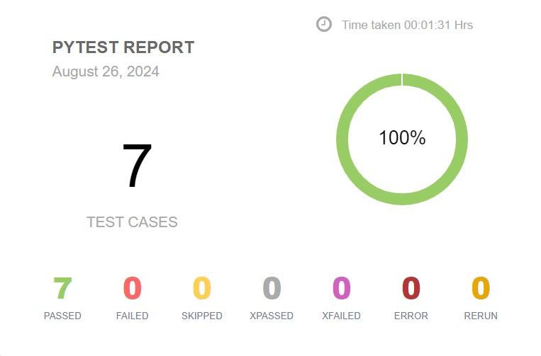

TP réalisé dans le cadre d'un cours sur l'automatisation de test unitaire
# Automatisation selenium/pytest

Le site www.demoqa.com met à disposition plusieurs modules qui visent à être testés de manière manuelle ou automatisée. 
Le but est ici d'automatiser les différents modules de ce site avec **Selenium** et **Pytest**. 

  - Utilisation du DOM (id, class, css_selector, xpath...)
  - Création de fonctions d'automatisation
  - mise en place d'assert afin de valider ou invalider nos tests
 

### Voici le code Python utilisé pour automatiser les test sur les différents modules:
  - [Code python pour le Formulaire](code/test_textbox.py)
  - [Code python pour les Checkbox](code/test_checkbox.py)
  - [Code python pour les Radios](code/test_yesradio.py)
  - [Code python pour le Webtables](code/test_webtables.py) 
 

### Appercu d'une session de test automatisée
 
### Rapport de test generé à la suite de nos tests

